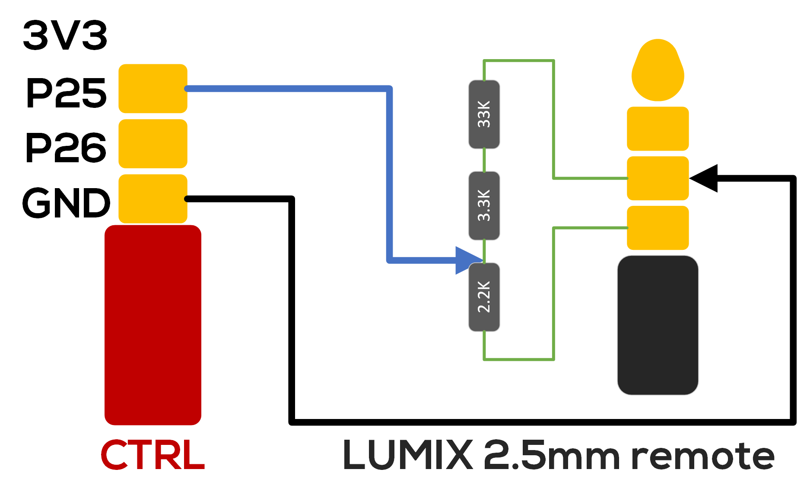

# Wiring to Camera

This page shows you some common wiring methods and precautions to use with the Flowshutter. We are working on adding support for more are more camera protocol/triggering methods, so this list is not exhaustive and keeps growing.

## Sony Multi-USB

!!! warning ""
    Sony Multi-Terminal USB interface is/maybe a Sony proprietary intellectual property.

This interface is commonly found on the micro SLR/SLR/movie machine that Sony has launched in recent years. There is often a **"MULTI"** mark around this interface to indicate "Multi Terminal". 

Correspond to [Sony Multi-Terminal Protocol](clist.md#sony-multi-terminal-protocol).

!!! note ""
    It should be noted that there is a resistor pad on the other side of the USB splint, and a resistor with a resistance value greater than 100K needs to be soldered on it so that the interface can be correctly recognized by the Sony camera.

!!! note ""
    Another type of connector does not place a resistor pad on the splint, so a 100K resistor needs to be connected in series between the pin labeled 6 and GND.

## Momentary Ground

Correspond to [Momentary Ground](clist.md#momentary-ground).

!!! warning ""
    Different cameras may have different interfaces/ports, please be sure to wire them correctly, otherwise it may cause the device to short circuit / lose warranty or even burn.

### BMPCC 4k/6k/6k Pro Recording Cable (ZITAY)

[ZITAY Official Link](https://www.zitay.net/ZITAY-BlackMagic-Design-Pocket-Cinema-Camera-4K-BMPCC-6K-Controlling-Cable-Controller-p931336.html)

It is worth mentioning that this Recording Cable from ZITAY actually wraps an HDMI-CEC controller based on `STM32F051` MCU under its gum shell. It is recommended to remove its shell and rewire it for using with Flowshutter.

### Panasonic LUMIX Remote Connector

Panasonic/LUMIX uses special voltage/resistance detection mechanism to trigger the REC start/stop, therefore, please note that when using this brand of camera, a 2.5mm four-pin connector must be used to insert the **REMOTE** port of the camera body, and additional circuits need to be built with resistors so that the signal can be recognized by the camera.

## 3.3V Schmitt Trigger

Correspond to [3.3V Schmitt Trigger](clist.md#33v-schmitt-trigger).

!!! warning ""
    Different cameras may have different interfaces/ports, please be sure to wire them correctly, otherwise it may cause the device to short circuit / lose warranty or even burn.

