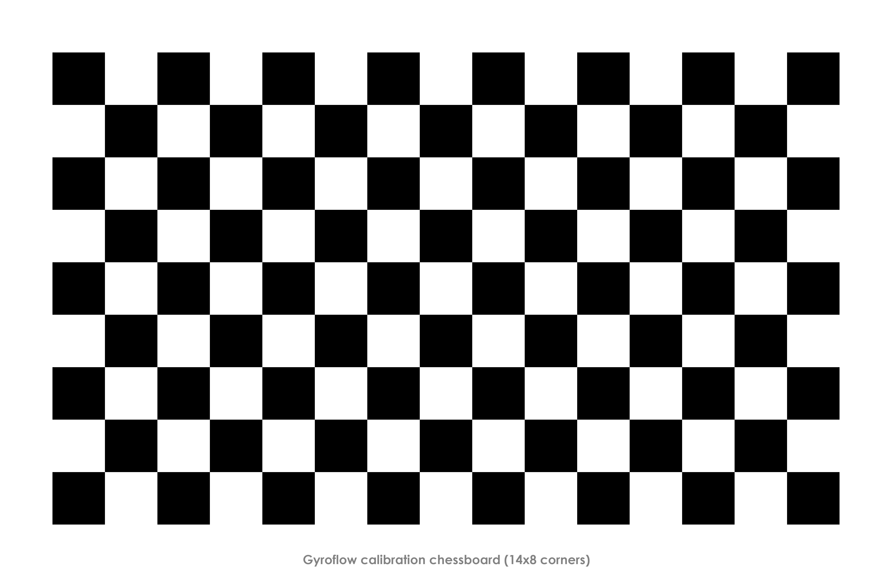

The purpose of the camera calibration process is to accurately determine the _intrinsic_ parameters of a camera system. This consists of:

- focal length
- lens distortions
- other misalignments during the imaging process.

These parameters can be found through **Lens Calibration**, which consists of imaging a known pattern, and analyzing the resulting footage. The Gyroflow lens calibrator looks like this:

{ width="100%" }

## Video Guide
Nurk FPV's tutorial contains a calibration example:
<iframe width="560" height="315" src="https://www.youtube.com/embed/QAds3x8UU1w?start=453" frameborder="0" allow="accelerometer; autoplay; clipboard-write; encrypted-media; gyroscope; picture-in-picture" allowfullscreen></iframe>

## Getting calibration footage
1. Display the calibration pattern on a flat computer monitor, preferably in full screen (available from the lens calibrator utility). You can also print it out if you prefer. In general, larger calibration patterns are preferred since focus will be closer to the focus during actual use. A bright screen with a slightly darkened room works well.
2. Select the desired camera settings to calibrate for. Most importantly the field of view/focal length and aspect ratio, if applicable. Framerate and resolution doesn't matter, only if the resolution changes the field of view. Too low shutter speed may also cause undesirable motion blur, but it's usually fine.
3. Record the pattern while slowly moving around to different angles and distances in one clip. 60 seconds is typically more than enough. Try to avoid motion blur by holding the camera still in each angles and with slow movements, and make sure the full chessboard is in view. The following angles are recommended for getting distortion information from the full frame:
   * Chessboard filling whole frame
   * Chessboard seen from distance.
   * Chessboard seen at an angle.
   * Each edge of video frame aligned with edge of chessboard.
   * Corner of chessboard aligned with corner of video.

The calibration pattern can be displayed from the calibration utility. Alternatively, the default (14x8 radon) calibration pattern is available here:
{ width="100%" }

The previous default (14x8 chessboard) calibration pattern is also available below:
{ width="100%" }

Tip: Larger calibration patterns allow for more representative focal distance. Try using the largest screen available, especially with larger lenses.

## Creating camera preset
1. Start the Gyroflow tool and click `create new` under the lens profile tab.
2. Open the previously recorded calibration video file.
4. Either begin auto calibration or manually add frames using `add calibration point` from the timeline context menu.
5. After either the automatic or manual calibration process, check the `reprojection error`. This value describes the overall error between the preset and actual lens distortion based on the expected features of the calibration pattern.
8. After all required frames are added and processed, the straight lines should be straight in the undistorted video. Reprojection error should typically be under 5 (pixels) with excellent calibrations giving values below 1.
9. Fill in the preset information and export the lens profile. Try to add all relevant information about the camera/lens combination including field of view setting and lens focal length if applicable.
10. If a successful calibration was achieved with a low reprojection error and no obvious artefacts, the profile can be submitted with the `Upload lens profile to the database` checkbox.
11. You're now ready to use the new lens preset. These are stored as `.json` files.

## Additional calibration options
The lens calibrator contains additional options.

### Default output size
Radial lens undistortion typically results in the image being stretched more in the horizontal axis (use the FOV slider to see this). For instance, undistorted 4:3 GoPro video:

{ width="40%" }

Notice that the area of the valid rectangle is close to a 16:9 aspect ratio as opposed to 4:3. In these cases, the default output size can be modified to a 16:9 one.

For cameras with minimal fisheye distortion, or even with pincushion distortion, the resulting valid aspect ratio is close to the original one. For these cameras, just use the input resolution for the default output size.

### Sharpness limit
Sets the minimum required sharpness for the calibration pattern. If the pattern failed to detect due to focus or blurriness, try increasing this limit.