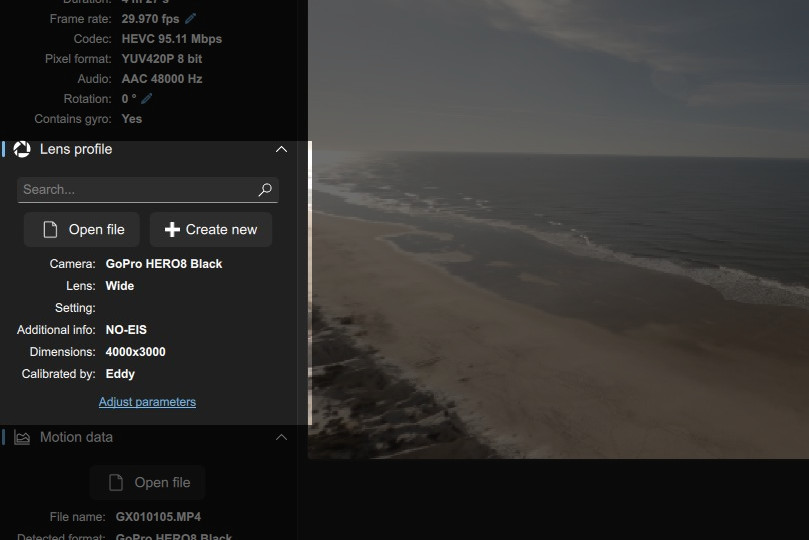
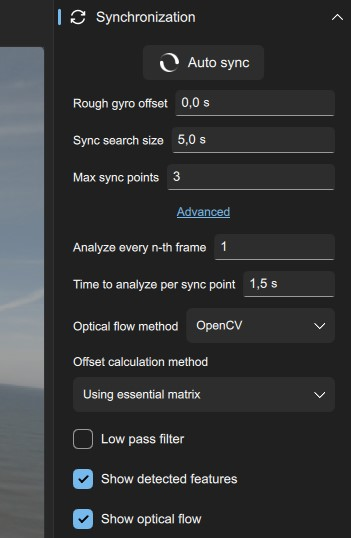

Gyroflow has a large number of settings for customizing everything. This page contains a short description and guide to each of the settings. Luckily, many of the settings are self-explanatory.

{ width="100%" }
## Input/video information
{ width="100%" }

After opening a video file, video information and metadata are displayed here.

### Frame rate
Set this value to the actual recording frame rate if it doesn't match the detected frame rate. This is the case for footage from some high speed cameras which play back in slow motion.

### Rotation
Modify the angle if unexpected video rotation is present (e.g. camera accidentally recording using portrait mode).

## Lens profile
{ width="100%" }

Gyroflow requires correct lens profiles for undistortion and correctly applying the stabilization. For GoPro cameras, this is automatically detected based on the metadata. For other cameras, either search for the lens profile, or create a new profile (see the [calibration guide](../calibration)).

The lens profile is specific to a combination of a camera, a lens, a field of view, and the recording setting/aspect ratio. In general, it is best if the profile matches the setup exactly, but the same profile can be used if everything else matches except:

* Frame rate
* Resolution (with the same FOV and aspect ratio)

This is the case since the lens distortion is independent from the framerate and is scaled to account for resolution differences.

Lens profiles are stored as JSON files, which can be loaded without being part of the database.

## Motion data
{ width="40%" }

The motion data can either be embedded in the video file (GoPro/Insta360/Sony) or loaded as a separate motion data file (drone blackbox/Runcam/etc). Videos with embedded motion data can be treated as a motion data file as well, meaning an action camera like a GoPro can be mounted on a larger camera as a motion logger. The log detection and parsing uses [telemetry-parser](https://github.com/AdrianEddy/telemetry-parser)

For more information about specific gyro logging methods, see pages under `Gyro Logging`.

### Low pass filter
Gyro data (especially from drones) can be noisy without filtering. Low pass filters essentially reduce frequencies above the cutoff frequency. If the gyro data appears too noisy, try enabling this filter with a cutoff of 50 Hz, with lower frequencies giving more filtering ([more info here](/tech/filtering/)).

### Rotation
If the gyroscope sensor isn't aligned at right angles with the camera, an additional rotation can be applied here. For FPV users using blackbox data with a camera tilt, change the Pitch value to match the angle between the camera and the flight controller.

### IMU Orientation
The compact `xyz` notation is used to describe the right-angle orientation between the camera and the gyro, with uppercase letters being positive and lowercase being negative. In most cases, this is automatically detected, but if stabilization appears to be applied in the wrong direction/axis, changing the IMU orientation may be required.

### Integration method
For translating the raw gyroscope and accelerometer sensor readings to actual orientations usable for video stabilization, an integration method is used. Currently available are:

* None - Only applicable for cameras with pre-computed orientations (Hero 8 and newer)
* Madgwick filter
* Complementary filter
* Mahony filter
* Gyroflow integration

Madgwick, Complementary, and Mahony all use a combination of gyroscope and accelerometer for estimating the orientation. The accelerometer allows for determining the downwards direction, meaning these integrators can be used with **Lock horizon**. With horizon lock, the Complementary filter usually gives decent results with the least horizon drift, but you can compare yourself.
By comparison, the Gyroflow option only uses the gyroscope and doesn't work with horizon leveling.

For hero 8 and newer, selecting **None** means no synchronization is required at all.

## Synchronization
Synchronization is typically required between the video and and gyro data. This can either be auto-sync, or by manually syncing at specified times by right-clicking the timeline.
{ width="40%" }

### Rough gyro offset
If a significant delay is present between the start of the video recording and gyro recording, the rough gyro offset needs to be changed. Example: if you start video recording followed by gyro recording 30 seconds later, use 30 s here.

### Sync search size
Gyroflow analyzes a segment of the video, and attempts to find the most likely match within this _search size_ in order to avoid false positives.

### Max sync points
Number of automatically added sync points.

### Analyze every n-th frame
This is typically left unchanged. By setting this to a number larger than 1, frames are skipped during the motion analysis. One use case is high framerate footage, where the relative motion between two subsequent frames is too small for reliable sync.

### Time to analyze per sync point
Determines the number of frames analyzed analyzed for each sync point. More frames take slightly longer, but may give a better sync. The default is typically fine.

### Optical flow method
Select the optical flow implementation. Either OpenCV (typically faster and preferred) or AKAZE.

### Offset calculation method
This is the method used to estimate the gyro-video offset.

* Using essential matrix - Estimate relative roll/pitch/yaw angular rates between each frame, and correlate with gyro sensor data.
* Using visual features - Estimate the gyro offset such that the tracked features move the least between frames.

### Low pass filter
Apply a low pass filter to the estimated video motion. This is rarely needed.

### Show detected features / Show optical flow
Shows the motion in the video player during playback

## Stabilization
This is an exciting menu: The actual video stabilization! In general, try playing with the different stabilization algorithms. Each result in a different "look" for the stabilized video. If you're interested in developing your own stabilization algorithm, take a look [here](../../tech/smoothing).
{ width="40%" }

### FOV
Apply a scale to the field of view of the output video.

### Stabilization algorithm
The currently available stabilization algorithms are:

* No smoothing - Useful if only lens undistortion is desired
* Plain 3D - Simple general purpose smoothing algorithm described [here](../../tech/smoothing). Smoothing applied symmetrically in 3D with no rotation limit (doesn't work for rapid camera motion).
* Velocity dampened - Decreases the smoothing during significant camera motion in order to avoid the image moving out of frame.
* Velocity dampened per axis - Similar to Velocity dampened with individual roll/pitch/yaw smoothness control. Typically the roll axis can be smoothed out more.
* Lock horizon - Attempts to keep the horizon level. Works best for flight without fast rotational moves since some gyros can be maxed out. Try with the complementary filter.
* Fixed camera - Points the virtual camera in a fixed, used-defined direction. Can be useful for debugging or tweaking sync.

### Crop

Select the behavior of the cropping.

* No cropping - Remain at the user-defined FOV throughout the video
* Dynamic cropping - Dynamically adjust the field of view in order to hide any borders throughout the video. The `Smoothing window` influences how quickly the FOV changes in response to different stabilized frame orientations.
* Static crop - Static crop with FOV=1 being the FOV at which no edges are visible throughout the video.

### Rolling shutter correction
Rolling shutter artifacts are visible during fast camera motion, and appears as "wobbling" or skewed lines. This option requires precise gyro-video sync.
Find a spot in the video with clear rolling shutter artifacts, and adjust the frame readout time until these artifacts are minimized. By default, the frame readout is assumed to be from top to bottom. This is changed with the checkbox.

The readout time can also be estimated with the "Estimate rolling shutter here" option in the context menu of the timeline, although this is experimental.

## Export
The options here are fairly self-explanatory. For any doubts, see the tooltips. By default, the resolution and bitrate are selected to correspond closely to the input file
{ width="40%" }

From the dropdown of the export button, it is possible to export a `.gyroflow`. This file contains all the required data and sync information for a video file, and is automatically detected the next time you want to process the same file.