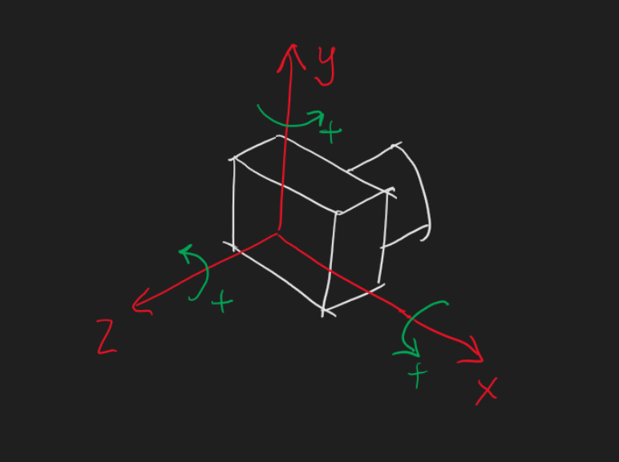

This page contains an example of how data logging can be implemented.

{ width="100%" }

## Hardware
An MEMS Inertial Measurement Unit (MEMS IMU) is a chip containing a gyroscope and an accelerometer. The gyroscope measures the rotational rate, while the accelerometer measures acceleration as the name implies. Gyroflow requires the gyroscope, while the accelerometer is optional and only required if horizon referencing is desired. An example of the acceleration and rotational axes around a camera is illustrated above. Many camera systems already contain such an IMU for electronic image stabilization, so in some cases, it is possible to allow for motion logging through a firmware update.

For a dedicated logger, a simple combination of a memory device (MicroSD/SPI Flash chip etc.), a microcontroller, and an inertial measurement unit suffices. This hardware combination is readily available as low-cost drone flight controllers, which can act as loggers as described on [another page](../betaflight). Dedicated hardware for this task is currently under development as part of the Gyroflow project.

## Software/Firmware
On the software and firmware side, the inertial measurement unit should be configured correctly. Refer to the datasheet of your IMU for information about how to configure this exactly. It has been found that the following IMU settings offer a reasonable starting point.

* logging rate: 500 Hz
* Low pass filter cutoff: 50 to 100 Hz
* gyro scaling: 1000 deg/s
* acceleration scaling: +/- 8 g

The minimum logging rate sufficient for stabilization is approximately 100 Hz, but note that such a low logging rate requires excellent filtering in order to avoid data loss and aliasing. Using a 500 Hz logging rate with a 100 Hz cutoff allows for some margin of error in terms of aliasing.

## Logging
Logging of Gyroscope, and optionally, Accelerometer and Magnetometer can be in various formats. The `.gcsv` log format described [here](../gcsv) is a simple to implement format suitable for basic motion loggers.