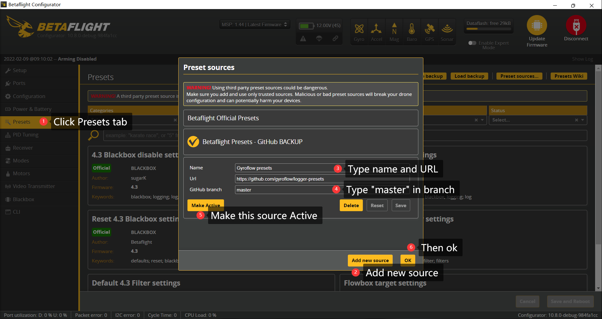
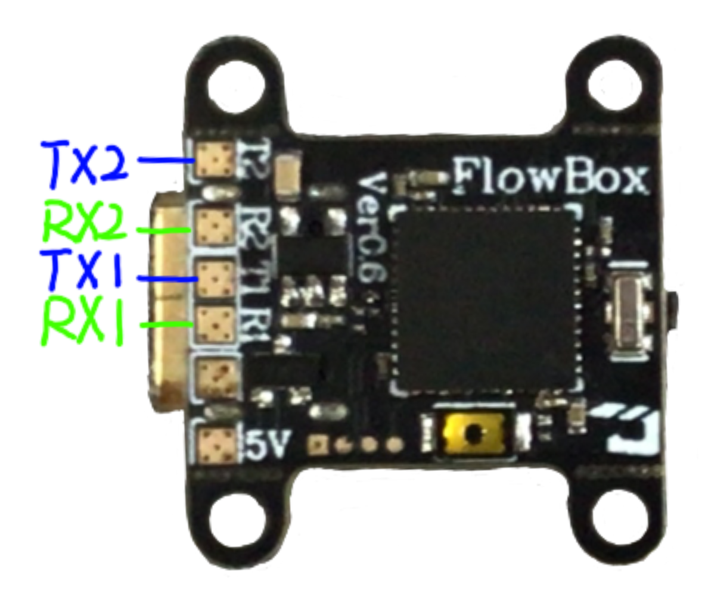

Flowbox is an extremely compact gyro logger developed for using with Gyroflow. It has:

- USB-C connector
- F411
- BMI270
- 128MB onboard SPI flash chip
- onboard beeper
- 2 UARTs

It is not yet available, but here's basic tutorial.

## Start with presets

Since the flowbox is based on F411 MCU and BMI270 gyroscope, only betafligh 4.3 or newer firmware support it.

We have a gyroflow-betaflight presets source for your convenience, and you can quickly set up your flowbox with "one click".

Gyroflow-betaflight preset source can be easily set up followed the picture shown below:



```
https://github.com/gyroflow/logger-presets
```

## Tranditional setup procedure

### Flash firmware

The flashing procedure is pretty same like other betaflight flight controllers. here's the step:

1. Connect your flowbox to your computer.
2. Open the latest betaflight configurator (version 10.8.0 or newer).
3. Open "Firmware Flasher", search and choose "flowbox" in the target selector
4. Select 4.3.0 or newer firmware version.
5. Hit the "Load Firmware \[Online]" button, then later hit the "Flash Firmware" button.

6. Once the flashing progress is done, try to connect. The configurator will ask you whether apply the custom default. Click "Apply Custom Default" button.

7. Then reconnect, whola!

### Settings

It is recommended to use a single PT3 @80Hz on gyroscope data for this application usage.
Also, the dynamic notch filter could be quite useful for hard mounted, but this would request to config the motor protocol to be Dshot300.

```
feature DYNAMIC_FILTER
set runaway_takeoff_prevention = OFF
set pid_process_denom = 1
set motor_pwm_protocol = DSHOT300
set simplified_gyro_filter = OFF
set gyro_lpf1_static_hz = 0
set gyro_lpf2_type = PT3
set gyro_lpf2_static_hz = 80
set gyro_lpf1_dyn_min_hz = 0
set gyro_lpf1_dyn_max_hz = 0
set simplified_gyro_filter = OFF
```
This can also be done in GUI, but CLI command is easy and no bias.

### Logging trace

Since flowbox was used as a secondary FC which only the gyro data is need, we can simply disable other "useless" log traces in order to save flash space and reduce log size.
```
set blackbox_sample_rate = 1/16
set blackbox_disable_pids = ON
set blackbox_disable_rc = ON
set blackbox_disable_setpoint = ON
set blackbox_disable_bat = ON
set blackbox_disable_mag = ON
set blackbox_disable_alt = ON
set blackbox_disable_rssi = ON
set blackbox_disable_acc = ON
set blackbox_disable_debug = ON
set blackbox_disable_motors = ON
set blackbox_disable_gps = ON
```

If you want to use gyroflow's "horizon lock" features:
```
set blackbox_disable_acc = OFF
```

### Board orientation

Based on your mounting, you should change the board orientation so for the board can record the correct motion data.


### Trigger the recording

There are many ways to trigger the blackbox record, here we simply show you the mostly common used two ways.

- Triggered by receiver
- No trigger, record blackbox data automatically when power up

#### By receiver

Betaflight can record blackbox when the FC was ARMed. So you need to hook a serial receiver to a UART and set it up properly in betaflight configurator.

Flowbox has two UARTs, which support a lot of serial receiver (not included SBUS protocol) include CRSF, iBUS, SRXL, etc. The pads are shown as below:



Once the receiver is hooked up, you need to set the corespond UART and protocol.


#### No trigger

Betaflight can also record blackbox when the FC was powered up. Simply set the `blackbox_mode = ALWAYS`

```
set blackbox_mode = ALWAYS
```

## Use with flowshutter

Check [flowshutter](flowshutter/flowshutter.md)
